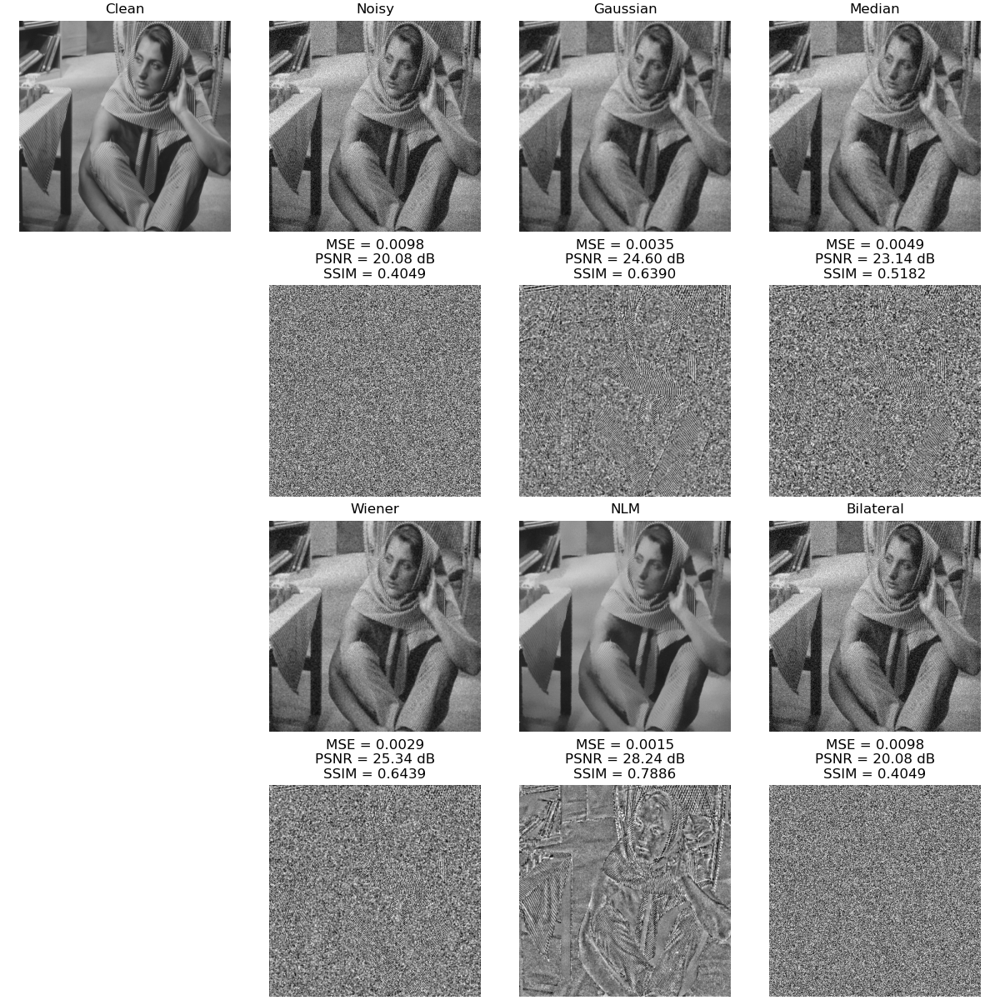
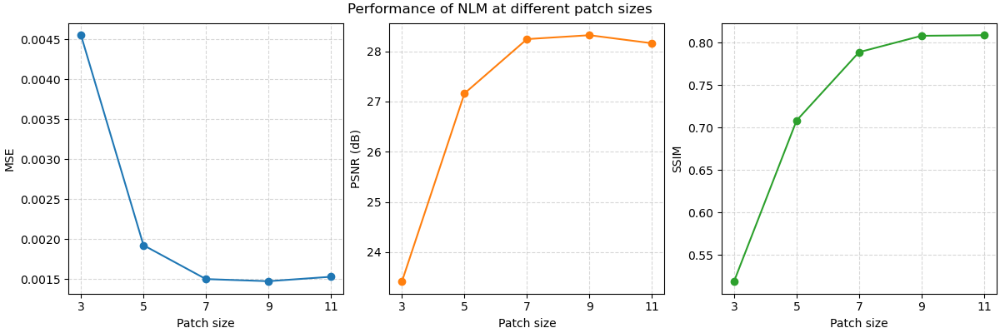
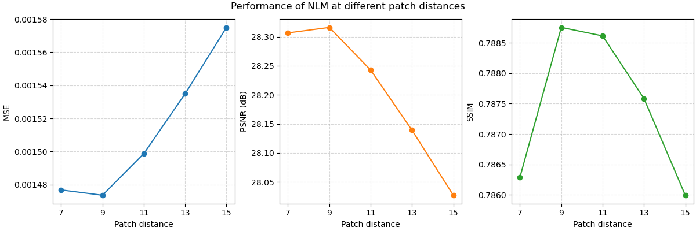
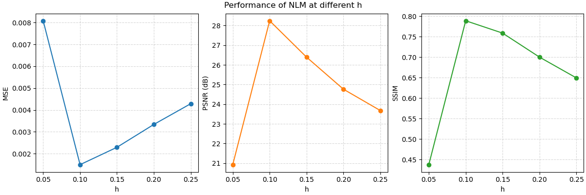

EC 520 Project: Image denoising using non-LSI filters
=====================================================

Requirement
-----------

```bash
pip install numba numpy scipy scikit-image
```

Preliminary results
-------------------

We compared NLM and bilateral filtering (not implemented yet) to Gaussian, median, and Wiener filtering on the `'barbara.tif'` image. The results are shown in the following figure.



We further characterized the performance of NLM under different patch sizes, search window sizes, and smoothing parameter `h`. The results are shown in the following figures.







To reproduce the results, run `test.py`.
