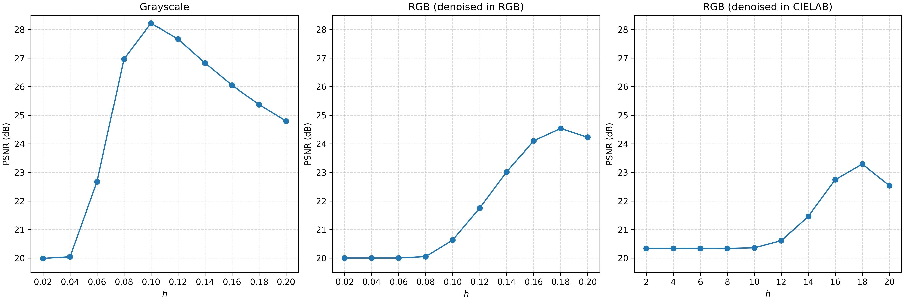
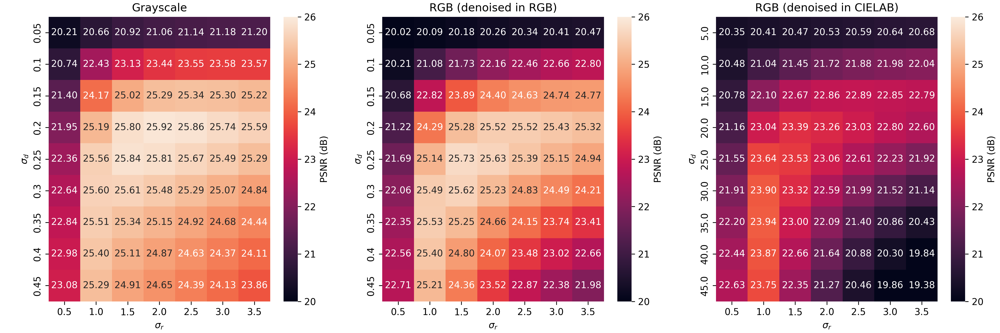
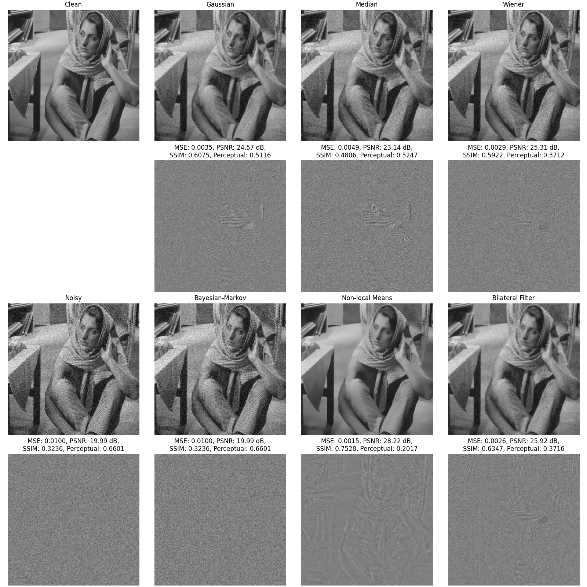
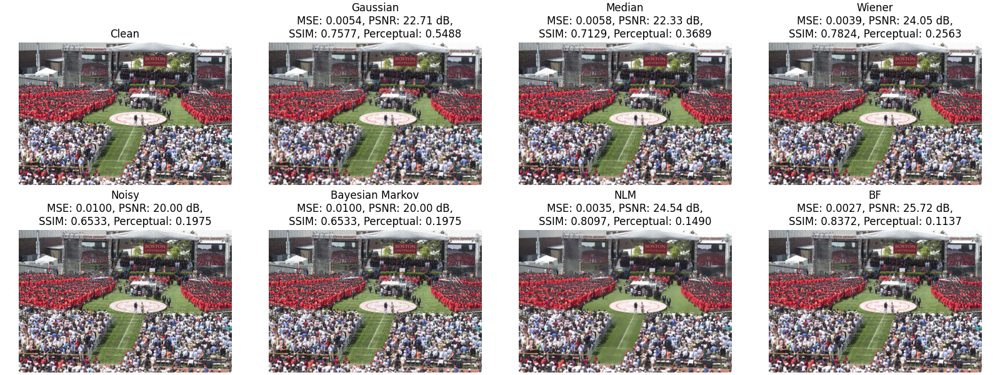
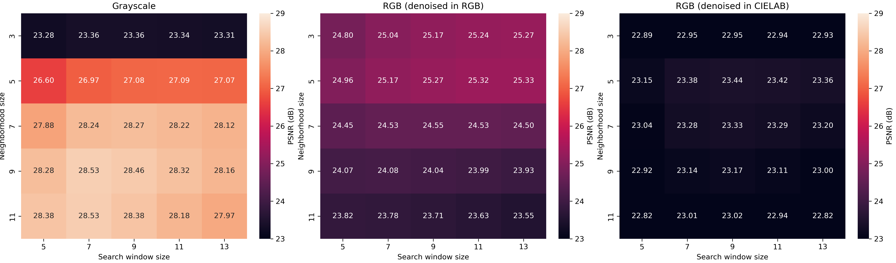

EC 520 Project: Image denoising using non-LSI filters
=====================================================

Requirement
-----------

```bash
pip install numba numpy scipy scikit-image matplotlib pillow
```


Download datasets (BSD100 and Urban100)
---------------------------------------

```bash
bash data.sh
```


Figure/table plan
-----------

Main:
- [x] Figure 1. Example image from BSD100.
- [x] Figure 2. Example image from Urban100.
- [x] Figure 3 (a). Grid search over `h` for non-local means using grayscale `barbara.tif`.
- [x] Figure 3 (b). Grid search over `h` for non-local means using RGB `bu2010.tif` (denoising in RGB space).
- [x] Figure 3 (c). Grid search over `h` for non-local means using RGB `bu2010.tif` (denoising in LAB space). 



- [x] Figure 4 (a). Grid search over combinations of `sigma_spatial` and `sigma_range` for bilateral filtering using grayscale `barbara.tif`.
- [x] Figure 4 (b). Grid search over combinations of `sigma_spatial` and `sigma_range` for bilateral filtering using RGB `bu2010.tif` (denoising in RGB space).
- [x] Figure 4 (c). Grid search over combinations of `sigma_spatial` and `sigma_range` for bilateral filtering using RGB `bu2010.tif` (denoising in LAB space).



- [ ] Figure 5. Comparison on `barbara.tif`. (Note: baselines are not tuned, median and Gaussian--Markov restoration are not implemented.)



- [ ] Figure 6. Comparison on `bu2010.tif`. (Note: baselines are not tuned, median and Gaussian--Markov restoration are not implemented.)



- [x] Table 1. Quantitative results on BSD100 and Urban100.

BSD100:

| Method | MSE | PSNR | SSIM |
| --- | --- | --- | --- |
| Noisy | 0.0100 (0.0000) | 20.00 (0.01) | 0.4044 (0.1238) |
| Gaussian | 0.0029 (0.0016) | 25.95 (2.12) | 0.6746 (0.0529) |
| Median | 0.0037 (0.0017) | 24.65 (1.66) | 0.5745 (0.0706) |
| Wiener | 0.0027 (0.0009) | 25.79 (1.14) | 0.6400 (0.0764) |
| Bayesian Markov | 0.0100 (0.0000) | 20.00 (0.01) | 0.4044 (0.1238) |
| NLM | 0.0021 (0.0010) | 27.35 (2.32) | 0.7421 (0.0773) |
| BF | 0.0018 (0.0005) | 27.55 (1.26) | 0.7187 (0.0529) |

Urban100:

| Method | MSE | PSNR | SSIM |
| --- | --- | --- | --- |
| Noisy | 0.0100 (0.0000) | 20.00 (0.00) | 0.4617 (0.1159) |
| Gaussian | 0.0048 (0.0030) | 23.96 (2.57) | 0.6738 (0.0522) |
| Median | 0.0051 (0.0026) | 23.44 (2.06) | 0.5928 (0.0692) |
| Wiener | 0.0032 (0.0011) | 25.19 (1.38) | 0.6696 (0.0664) |
| Bayesian Markov | 0.0100 (0.0000) | 20.00 (0.00) | 0.4617 (0.1159) |
| NLM | 0.0019 (0.0008) | 27.73 (2.02) | 0.8209 (0.0603) |
| BF | 0.0020 (0.0005) | 27.16 (1.15) | 0.7455 (0.0535) |


Supplementary:
- [x] Figure S1 (a). Grid search over `patch_size` and `patch_distance` for non-local means using grayscale `barbara.tif` to demonstrate insensitivity to these parameters.
- [x] Figure S1 (b). Grid search over `patch_size` and `patch_distance` for non-local means using RGB `bu2010.tif` (denoising in RGB space) to demonstrate insensitivity to these parameters.
- [x] Figure S1 (c). Grid search over `patch_size` and `patch_distance` for non-local means using RGB `bu2010.tif` (denoising in LAB space) to demonstrate insensitivity to these parameters.


